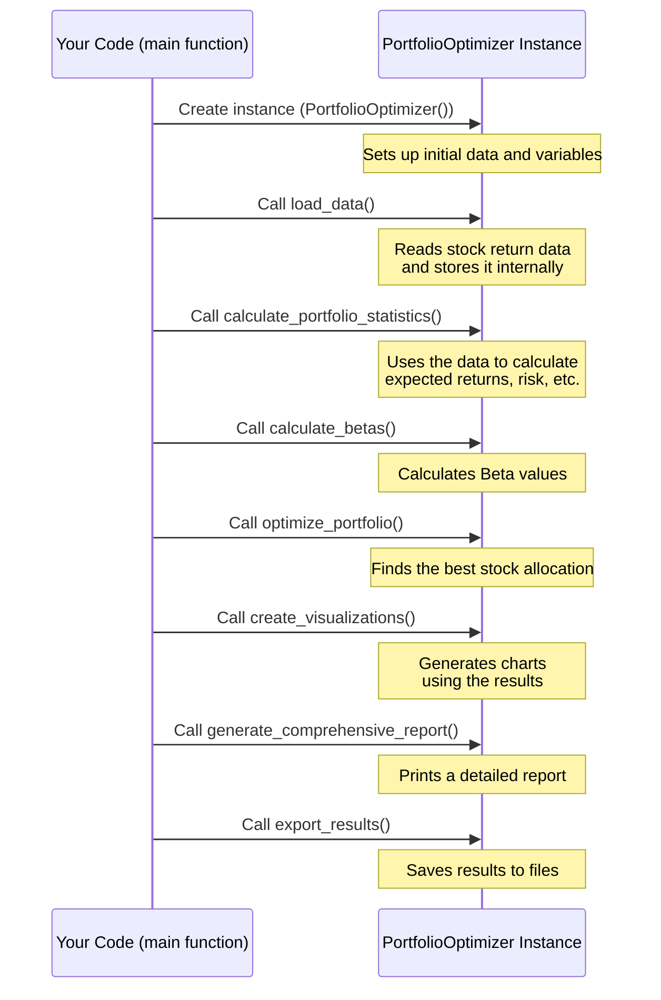

# Chapter 1: PortfolioOptimizer Class

Welcome to the first chapter of the Portfolio Optimizer tutorial! In this chapter, we'll meet the central piece of our project: the `PortfolioOptimizer` class. Think of this class as the main control center for everything we want to do with our stock portfolio.

## What is the `PortfolioOptimizer` Class?

Imagine you have a big project to manage – like building a treehouse. You need someone to plan the steps, gather the tools, make sure everything is done in the right order, and finally, show off the finished treehouse.

In our project, optimizing a stock portfolio is the big project. The `PortfolioOptimizer` class is like that **project manager** or the **engine** that drives the whole process. It contains all the instructions and tools needed to:

1.  Get the stock data.
2.  Perform calculations (like finding out how risky stocks are or how much return they might give).
3.  Figure out the best mix (allocation) of stocks for your portfolio.
4.  Show you the results with charts and reports.

Instead of writing many separate pieces of code that need to talk to each other, we put related functions and data together inside this class. This makes our project organized and easier to use.

## Getting Started: Creating Your Project Manager

To use the `PortfolioOptimizer` class, you first need to create an "instance" of it. Think of the class as a blueprint for the project manager, and creating an instance is like hiring a specific person to be *your* project manager.

Here's the code to do that:

```python
# First, make sure you have the PortfolioOptimizer class defined
# (We'll see the full code later, but for now, assume it exists)
from portfolio_optimizer import PortfolioOptimizer # Assuming the class is in portfolio_optimizer.py

# Create an instance (hire your project manager)
optimizer = PortfolioOptimizer()

print("Okay, my portfolio optimizer is ready!")
```

This single line `optimizer = PortfolioOptimizer()` creates a `PortfolioOptimizer` object, which we store in a variable called `optimizer`. Now, this `optimizer` variable holds our "project manager" and is ready to start working.

## What Does the Optimizer Know Initially?

When you first create the `PortfolioOptimizer` instance, it starts with some basic information and gets ready for the upcoming tasks. This happens inside a special method called `__init__` (pronounced "dunder init").

Think of `__init__` as the setup phase for your project manager. They know the names of the stocks they'll work with, the risk-free rate they need to consider, and they set up placeholders for the data and results they will collect later.

Let's look at a simplified version of the `__init__` method from our code:

```python
class PortfolioOptimizer:
    """
    Portfolio Optimization Class implementing Modern Portfolio Theory
    """

    def __init__(self):
        # Stocks we will analyze
        self.stocks = ['RIL', 'HDFC', 'ICICI', 'TCS', 'ITC']

        # The risk-free rate needed for calculations like Sharpe Ratio
        self.risk_free_rate = 0.0057 # Annual rate

        # These will hold data and results later, starting as empty
        self.returns_data = None
        self.expected_returns = None
        self.cov_matrix = None
        self.optimal_weights = None
        self.betas = None

# We would create an instance like before:
# optimizer = PortfolioOptimizer()
# print(optimizer.stocks) # Output: ['RIL', 'HDFC', 'ICICI', 'TCS', 'ITC']
```

The `__init__` method doesn't do any heavy calculations yet. It just initializes the `optimizer` object by setting up its initial properties (`self.stocks`, `self.risk_free_rate`, etc.).

## How to Make the Optimizer Work: Calling Methods

Our `PortfolioOptimizer` instance isn't just a container; it has capabilities or actions it can perform. These actions are called **methods** in Python. To make the optimizer *do* something, you call one of its methods using the dot (`.`) notation.

The typical workflow involves calling these methods in a specific sequence:

1.  **Load the data:** Get the historical stock returns.
2.  **Calculate statistics:** Analyze the data to find expected returns and risks.
3.  **Calculate betas:** Understand how each stock relates to the overall market.
4.  **Optimize the portfolio:** Find the best combination of stocks.
5.  **Visualize results:** Create charts to understand the outcome.
6.  **Generate a report:** Summarize all findings.
7.  **Export results:** Save the data.

Let's see this sequence using the methods of our `optimizer` instance (this sequence comes directly from the `main()` function in the project code):

```python
# Assuming 'optimizer' instance is already created

print("1️⃣ Loading historical data...")
optimizer.load_data()
# This calls the load_data method inside the optimizer object
# It will load the stock returns data and store it inside optimizer

print("\n2️⃣ Calculating portfolio statistics...")
optimizer.calculate_portfolio_statistics()
# This calls the calculate_portfolio_statistics method
# It uses the loaded data to figure out returns and risks

print("\n3️⃣ Computing CAPM betas...")
optimizer.calculate_betas()
# This calls the calculate_betas method

print("\n4️⃣ Optimizing portfolio...")
optimizer.optimize_portfolio()
# This calls the optimize_portfolio method to find the best stock mix

print("\n5️⃣ Creating visualizations...")
optimizer.create_visualizations()
# This calls the method to generate charts

print("\n6️⃣ Generating comprehensive report...")
optimizer.generate_comprehensive_report()
# This calls the method to print a summary

print("\n7️⃣ Exporting results...")
optimizer.export_results()
# This calls the method to save results to files
```

Each `.method_name()` call tells the `optimizer` object to perform a specific task using the data and properties it holds.

## The Workflow Visualized (Simple View)

Here's a simple diagram showing how the main part of the program (`main`) interacts with the `PortfolioOptimizer` instance:



As you can see, the `Main` part of your program is like the conductor, telling the `Optimizer` (the orchestra) which piece to play next by calling its methods in order.

## Conclusion

The `PortfolioOptimizer` class is your primary tool for analyzing and optimizing a stock portfolio in this project. You create an instance of it and then call its methods step-by-step to perform the entire analysis pipeline, from loading data to generating reports.

In the next chapter, we will dive into the very first step: [Historical Returns Data](02_historical_returns_data_.md). We'll see how the `load_data` method works and what kind of information it prepares for the optimizer.

[Next Chapter: Historical Returns Data](02_historical_returns_data_.md)

---
