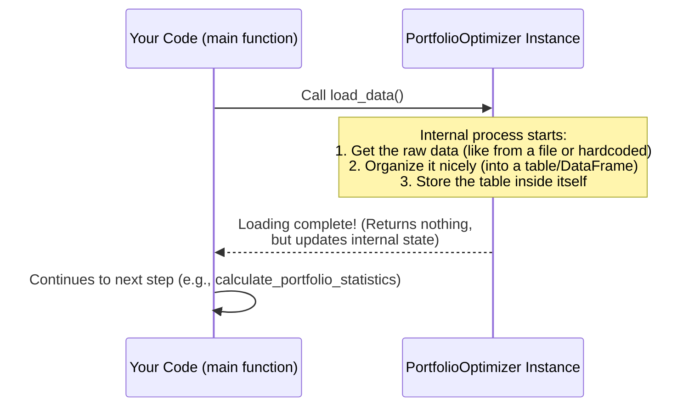

# Chapter 2: Historical Returns Data

Welcome back to the Portfolio Optimizer tutorial! In our [first chapter](01_portfoliooptimizer_class_.md), we met the `PortfolioOptimizer` class, our project manager for portfolio analysis. We saw how to create an instance of this class and learned that it has methods (actions) it can perform, like `load_data()`, `calculate_portfolio_statistics()`, and so on.

But what does the `optimizer` work *with*? It needs data! Just like a builder needs raw materials (wood, nails, tools) before they can start building a treehouse, our `optimizer` needs historical stock information to do its job. This brings us to the concept of **Historical Returns Data**.

## What is Historical Returns Data?

Imagine you want to know if a sports team is good. You wouldn't just guess; you'd look at their past game scores – did they win? By how much? Who were they playing against?

Historical Returns Data is similar. It's the **past performance history** of the stocks we are interested in, and also the overall market (in this case, the NIFTY index). For our project, this data tells us **how much each stock and the NIFTY index gained or lost each month** over a specific period.

Think of it as a **history book** for our investments. It records the monthly changes (returns) for each stock like RIL, HDFC, ICICI, TCS, and ITC, as well as the NIFTY index itself.

| Date     | RIL   | HDFC  | ICICI | TCS   | ITC   | NIFTY |
| :------- | :---- | :---- | :---- | :---- | :---- | :---- |
| Feb 2019 | 0.36% | -0.12%| -3.92%| -1.31%| -0.93%| -0.36%|
| Mar 2019 | 10.68%| 11.62%| 14.38%| 0.92% | 7.68% | 7.70% |
| ...      | ...   | ...   | ...   | ...   | ...   | ...   |
| Dec 2022 | -3.02%| 0.12% | -3.23%| -0.30%| 0.03% | -1.05%|

*(Note: The table above shows percentage values for clarity, but the actual data in the code uses decimal form, e.g., 0.0036 for 0.36%)*

This raw data is the essential **input** for our `PortfolioOptimizer`.

## Why Do We Need This Data?

The historical data is crucial because:

1.  **Understanding Past Behavior:** By looking at how stocks performed in the past, we can see how volatile they were (how much their price jumped around) and what their average returns looked like.
2.  **Predicting (or Estimating) Future Trends:** While past performance is no guarantee of future results, it's the best information we have to make educated estimates about what might happen in the future. We use historical data to calculate things like expected returns and risks.
3.  **Calculating Relationships:** The data shows us how stocks moved in relation to each other and the market. Did Stock A usually go up when Stock B went up? Did it move with the NIFTY index? This is key for diversification.

Without this historical context, the `optimizer` would have no information to base its analysis on.

## Getting the Data into the Optimizer

In [Chapter 1](01_portfoliooptimizer_class_.md), we saw the typical workflow starts with `optimizer.load_data()`. This method is responsible for reading the historical returns data and storing it inside our `optimizer` instance so that other methods can use it.

Here's that step again:

```python
# Assume optimizer instance is already created
# from portfolio_optimizer import PortfolioOptimizer
# optimizer = PortfolioOptimizer()

print("1️⃣ Loading historical data...")
optimizer.load_data() # This tells the optimizer to load the data
```

When you call `optimizer.load_data()`, you are telling the `optimizer` object to run its internal data loading process. Once this method finishes, the `optimizer` instance will hold the historical returns data, ready for the next steps.

## What Happens When `load_data()` is Called?

Let's visualize the simple interaction:



This diagram shows that the `load_data()` method is an action the `Optimizer` performs upon request from your main code. Its main job is to prepare and store the data internally.

## Inside the `load_data()` Method

How does the `optimizer` actually get and store this data? Let's look at a simplified version of the `load_data` method from the project's code (`Complete Portfolio Optimization Code.md`):

```python
# Inside the PortfolioOptimizer class...

def load_data(self):
    """Load the actual monthly returns data"""

    # 1. Raw data stored in a dictionary
    # (Imagine this came from reading a CSV file or database)
    monthly_data = {
        'Date': pd.date_range('2019-02-01', '2022-12-01', freq='MS'),
        'RIL': [0.0036, 0.1068, ...], # List of RIL returns month-by-month
        'HDFC': [-0.0012, 0.1162, ...], # List of HDFC returns
        # ... data for ICICI, TCS, ITC ...
        'NIFTY': [-0.0036, 0.0770, ...]  # List of NIFTY returns
    }

    # 2. Use pandas to turn the dictionary into a DataFrame
    # A DataFrame is like a spreadsheet table in Python
    self.returns_data = pd.DataFrame(monthly_data)

    # 3. Set the 'Date' column as the row index
    # This makes it easy to work with time-series data
    self.returns_data.set_index('Date', inplace=True)

    print("✓ Historical data loaded successfully")
    # ... print shape and period ...

# Note: This is a simplified view. The actual code in
# Complete Portfolio Optimization Code.md contains the full lists of data.
```

Let's break this down:

1.  **Raw Data:** In our project code, the historical data is **hardcoded** directly into the `load_data` method as a Python dictionary. Each stock name (and 'NIFTY') is a key, and its value is a list of monthly return numbers over the period. The 'Date' key holds a list of the corresponding dates. *(In a real-world project, this data would often be loaded from a file like a CSV or from a financial data provider, but hardcoding it here keeps the example simple).*
2.  **Pandas DataFrame:** The `pandas` library (which we'll see imported at the top of the full code) is a powerful tool for working with tables of data. `pd.DataFrame(monthly_data)` takes our dictionary and converts it into a `pandas` DataFrame – essentially, a table with rows and columns.
3.  **Setting the Index:** `self.returns_data.set_index('Date', inplace=True)` tells `pandas` to take the 'Date' column and use it as the label for each row instead of the default numbering (0, 1, 2...). This is standard practice for time-series data like stock returns and makes it easier to analyze data by date.
4.  **Storing the Data:** Finally, `self.returns_data = ...` assigns the resulting DataFrame to the `self.returns_data` variable within the `PortfolioOptimizer` instance. The `self.` part is important – it means this `returns_data` table is now stored *inside* this specific `optimizer` object and can be accessed by its other methods.

After `load_data()` runs, the `optimizer` now has its essential input: a table (`self.returns_data`) containing the monthly percentage changes for each stock and the market index over the specified historical period.

## Conclusion

Historical Returns Data is the foundation of our portfolio analysis. It's the record of past performance that the `PortfolioOptimizer` uses as its primary input. The `load_data()` method is the step where this historical data is read and organized into a structured format (a `pandas` DataFrame) and stored within the `optimizer` instance, making it available for all subsequent calculations.

Now that our `optimizer` has the data, the next logical step is to start analyzing it to understand key statistics like how much return each stock might be expected to give and how they move together.

[Next Chapter: Statistical Analysis (Expected Returns, Covariance Matrix)](03_statistical_analysis__expected_returns__covariance_matrix__.md)

---
