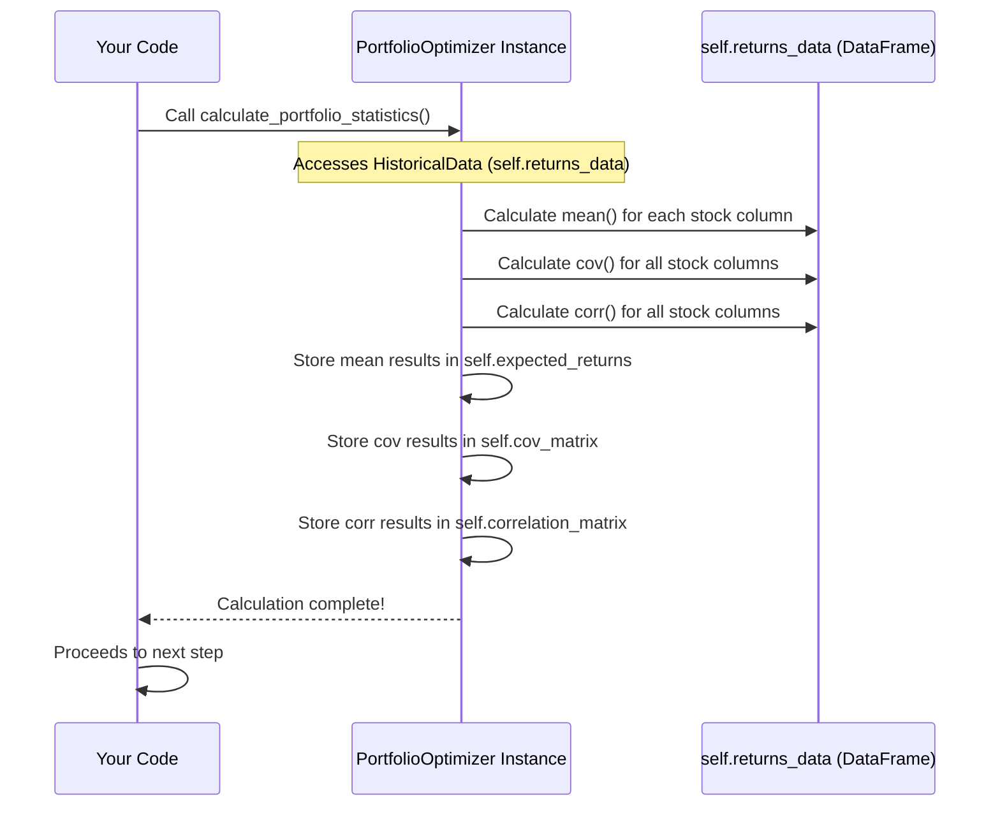

# Chapter 3: Statistical Analysis (Expected Returns, Covariance Matrix)

Welcome back! In the [previous chapter](02_historical_returns_data_.md), we learned about the importance of historical returns data and how the `optimizer.load_data()` method reads this information and stores it inside our `PortfolioOptimizer` instance. Now that our "project manager" (the `optimizer` object) has the raw materials (the historical returns), it's time to start analyzing them.

This chapter is about turning that raw history into meaningful insights. We need to answer questions like:

*   Based on the past, what's the *average* performance we might expect from each stock?
*   How do the different stocks tend to move *together*? When one stock goes up, is another likely to go up, go down, or does it do its own thing?

These insights are crucial because they form the basis for making smart decisions about which stocks to put in our portfolio and how much of each.

## The Goal: Turning History into Forecasts (Estimates)

Imagine you're trying to predict the average height of students in a school. You can't measure *every* student in the future, but you can measure the current students and calculate their average height. This average from the past is your best *estimate* for the average height in the future.

In investing, we do something similar. We look at the *past* historical returns data to get our best *estimates* for:

1.  **Expected Returns:** What average monthly return (gain or loss) might we expect from each stock?
2.  **How Stocks Move Together:** How do the returns of one stock relate to the returns of another? Do they usually rise and fall in tandem, or do they move in opposite directions?

These two pieces of information – Expected Returns and how stocks move together (measured by **Covariance** and **Correlation**) – are fundamental building blocks for Modern Portfolio Theory (MPT), which we'll use for optimization later.

## Key Statistics: Expected Returns and the Covariance Matrix

Let's break down the two main statistics we calculate:

### 1. Expected Returns

*   **What it is:** For each stock, this is simply the **average monthly return** over the historical period we loaded. It's our best *estimate* of the average return that stock might generate in a typical month going forward.
*   **Why it's important:** Higher expected returns sound great! But they usually come with higher risk, as we'll see later. We need this number to estimate the potential gain from each investment.
*   **In our project:** The `optimizer` will calculate the average monthly return for RIL, HDFC, ICICI, TCS, and ITC based on the data from February 2019 to December 2022.

Think of it like calculating the average score for each player on a sports team based on their past performance.

### 2. The Covariance Matrix

*   **What it is:** This is a table that shows how the returns of each pair of stocks move in relation to each other.
    *   The numbers on the diagonal (where a stock is paired with itself) represent the **variance** of that stock's returns. Variance and its square root (**standard deviation** or **volatility**) measure the *total risk* or *price fluctuation* of an individual stock.
    *   The numbers off the diagonal represent the **covariance** between two *different* stocks.
        *   A **positive covariance** means the two stocks' returns tend to move in the same direction (when one is above its average, the other tends to be too).
        *   A **negative covariance** means they tend to move in opposite directions (when one is above its average, the other tends to be below its average).
*   **Why it's important:** This is the magic sauce for **diversification**. If you combine assets that don't move perfectly together (low positive or even negative covariance), the overall ups and downs of the *portfolio* will be smoother than the individual assets. This reduces the *portfolio's* overall risk without necessarily sacrificing return.
*   **Related concept: Correlation Matrix:** Correlation is a standardized version of covariance, ranging from -1 to +1.
    *   +1 means perfect positive linear correlation (they move exactly together).
    *   0 means no linear correlation (they move independently).
    *   -1 means perfect negative linear correlation (they move in exact opposite directions).
    Correlation is often easier to interpret than covariance because its scale is fixed. The code calculates both the covariance and the correlation matrix.

Think of the covariance/correlation matrix as a table showing relationship status: "Are RIL and HDFC Returns in a relationship? If one smiles (up return), does the other smile (up return) too, or frown (down return)?"

Here's a simplified look at what a covariance matrix table might look like (actual values are calculated):

|          | RIL      | HDFC     | ICICI    | TCS      | ITC      |
| :------- | :------- | :------- | :------- | :------- | :------- |
| **RIL**  | Variance | Cov(RIL, HDFC) | Cov(RIL, ICICI) | ...      | ...      |
| **HDFC** | Cov(HDFC, RIL) | Variance | Cov(HDFC, ICICI) | ...      | ...      |
| **ICICI**| Cov(ICICI, RIL) | Cov(ICICI, HDFC) | Variance | ...      | ...      |
| **TCS**  | ...      | ...      | ...      | Variance | ...      |
| **ITC**  | ...      | ...      | ...      | ...      | Variance |

*(Note: Cov(A, B) is the same as Cov(B, A), so the matrix is symmetrical)*

## Using the Optimizer to Calculate Statistics

Just like loading data was a single method call, calculating these crucial statistics is also handled by one method within the `PortfolioOptimizer` class: `calculate_portfolio_statistics()`.

This method is designed to take the historical data that was loaded by `load_data()` and perform the necessary calculations to derive the expected returns, covariance matrix, and correlation matrix. It then stores these results back into the `optimizer` object for later use.

Here's how you call it in your main code:

```python
# Assume optimizer instance is created and data is loaded from Chapter 2
# from portfolio_optimizer import PortfolioOptimizer
# optimizer = PortfolioOptimizer()
# optimizer.load_data() # Data is now loaded into optimizer.returns_data

print("2️⃣ Calculating portfolio statistics...")
optimizer.calculate_portfolio_statistics() # This is the important step!

print("Statistics calculated and stored!")
# The expected returns, covariance, and correlation matrices
# are now available inside the 'optimizer' object.
```

After this line executes, the `optimizer` object will have the following internal variables filled:

*   `self.expected_returns`: A list or structure holding the average monthly return for each stock.
*   `self.cov_matrix`: A table (matrix) holding the variance and covariance values.
*   `self.correlation_matrix`: A table (matrix) holding the correlation values.

## What Happens Inside `calculate_portfolio_statistics()`?

Let's see a simplified view of the process when `optimizer.calculate_portfolio_statistics()` is called.



As the diagram shows, the `Optimizer` interacts with the `HistoricalData` it holds to perform calculations and then stores the results within itself.

Now, let's look at the simplified structure of the actual `calculate_portfolio_statistics` method in the code.

```python
# Inside the PortfolioOptimizer class...

def calculate_portfolio_statistics(self):
    """Calculate expected returns, covariance matrix, and correlations"""

    # --- Conceptually, this is what happens (but not exactly how code does it) ---
    # expected_returns = self.returns_data[self.stocks].mean()
    # cov_matrix = self.returns_data[self.stocks].cov()
    # correlation_matrix = self.returns_data.corr() # Including NIFTY

    # --- In THIS project's specific code, pre-calculated values are used ---
    # (This simplifies the example by avoiding reliance on exact calculation libraries)

    # Expected monthly returns (from PDF, based on historical average)
    expected_returns_dict = {
        'RIL': 0.013419,
        'HDFC': 0.014371,
        'ICICI': 0.015943,
        'TCS': 0.009538,
        'ITC': 0.010576
    }
    self.expected_returns = pd.Series(expected_returns_dict) # Store as pandas Series

    # Variance-Covariance Matrix (from PDF, based on historical data)
    cov_data_array = np.array([
        [0.007612, 0.003334, 0.003103, 0.002132, 0.001632],
        [0.003334, 0.005723, 0.005800, 0.001392, 0.002459],
        [0.003103, 0.005800, 0.008889, 0.000727, 0.002703],
        [0.002132, 0.001392, 0.000727, 0.004166, 0.000613],
        [0.001632, 0.002459, 0.002703, 0.000613, 0.004853]
    ])
    self.cov_matrix = pd.DataFrame(cov_data_array, index=self.stocks, columns=self.stocks) # Store as pandas DataFrame

    # Calculate correlation matrix (THIS IS CALCULATED FROM DATA in the code)
    # This includes NIFTY as well, which is useful for Beta calculation later
    self.correlation_matrix = self.returns_data.corr() # Calculate from the loaded data!

    print("\n✓ Portfolio statistics calculated")
    # ... code to print the calculated stats ...

```

**Explanation:**

1.  The method is called. It assumes `self.returns_data` (the DataFrame from `load_data()`) is already available.
2.  **Crucial Point:** In a typical scenario, you would use pandas methods like `.mean()` and `.cov()` directly on the `returns_data` DataFrame to calculate these values. I've shown commented-out lines illustrating this conceptual approach.
3.  **Project's Approach:** However, *for this specific project code*, the `expected_returns` and `cov_matrix` are assigned **pre-calculated values** that match the results shown in the source PDF. This is done to ensure the example reproduces the exact results from the source material reliably, even if slight variations might occur with different calculation library versions. These pre-calculated values are stored in Python dictionaries/arrays and then converted into pandas Series/DataFrames.
4.  **Correlation Matrix:** The `self.correlation_matrix` *is* actually calculated directly from the `self.returns_data` using `self.returns_data.corr()`. This matrix will include the correlations between each stock and the NIFTY index, which is useful for the CAPM Beta analysis in a later chapter.
5.  Finally, the method stores the calculated/assigned `expected_returns`, `cov_matrix`, and `correlation_matrix` into the `optimizer` object (`self.expected_returns`, `self.cov_matrix`, `self.correlation_matrix`). It also prints a confirmation message.

After this step, our `optimizer` object now holds not just the historical returns, but also the key summary statistics derived from that history: the estimated average return for each stock and how their returns tend to move together.

## Output of the Statistical Analysis

While the `calculate_portfolio_statistics` method stores the results internally, it also prints some of the results to the console. This helps us see what was calculated:

```
✓ Portfolio statistics calculated

Expected Monthly Returns:
RIL: 0.0134 monthly (16.10% annually)
HDFC: 0.0144 monthly (17.24% annually)
ICICI: 0.0159 monthly (19.13% annually)
TCS: 0.0095 monthly (11.45% annually)
ITC: 0.0106 monthly (12.69% annually)
```
*(Note: The annual returns are just the monthly returns multiplied by 12, a simple way to annualize monthly data).*

The covariance matrix and correlation matrix are stored internally but not printed directly by default (though the correlation matrix is used in the visualization later).

## Conclusion

In this chapter, we took the historical returns data loaded previously and performed the essential statistical analysis. We calculated the **Expected Returns** (the average historical return, used as an estimate for future average performance) and the **Covariance Matrix** (which tells us how the returns of different stocks tend to move together).

We saw that the `optimizer.calculate_portfolio_statistics()` method handles this process. While the project code uses pre-calculated values for expected returns and covariance for simplicity and exact reproducibility, it *does* calculate the correlation matrix from the loaded data. These statistics are now stored within the `optimizer` object, ready to be used in the next steps.

With the individual stock statistics in hand, the next step is to understand how a *combination* of these stocks – a portfolio – would perform.

[Next Chapter: Portfolio Performance Calculation](04_portfolio_performance_calculation_.md)

---
