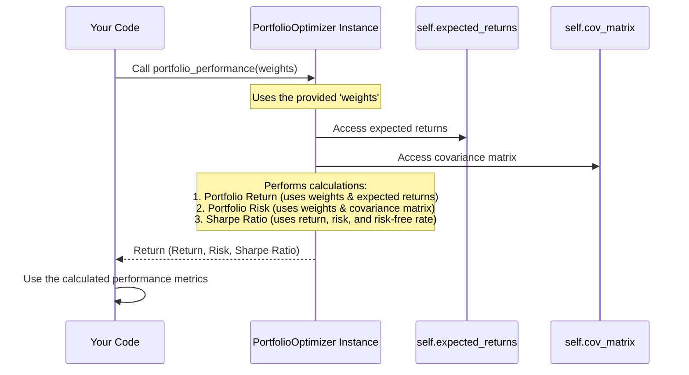

# Chapter 4: Portfolio Performance Calculation

Welcome back! In the last chapter, [Statistical Analysis (Expected Returns, Covariance Matrix)](03_statistical_analysis__expected_returns__covariance_matrix__.md), we learned how the `PortfolioOptimizer` calculates crucial statistics from the historical data: the expected return for each individual stock and the covariance matrix, which tells us how stock returns move together.

Now we have the building blocks: what each stock might do on its own (on average) and how they interact. But how do we use this information to understand the performance of a *combination* of these stocks – that is, a **portfolio**?

This is where **Portfolio Performance Calculation** comes in.

## The Goal: Evaluating a Specific Stock Mix

Imagine you have a recipe for a fruit salad. You have the ingredients (apples, bananas, grapes), and you might know how sweet or tart each fruit is individually. But the *taste* of the final salad depends on *how much* of each fruit you put in (the mix or proportions).

In our portfolio project, the "ingredients" are the stocks (with their expected returns and risks), and the "mix" is the **set of weights** – the percentage of your total investment money you put into each stock. For example, you might decide to put 30% in RIL, 20% in HDFC, 25% in ICICI, 15% in TCS, and 10% in ITC.

The problem we need to solve is: **Given a specific set of weights (a specific mix), what is the overall expected performance of the *entire portfolio*?** We want to know its total expected return and its total risk (volatility) for that particular combination of stocks.

The `PortfolioOptimizer` class has a function specifically designed for this: the `portfolio_performance` method.

## Introducing `portfolio_performance`

The `portfolio_performance` method is like the "recipe tester" for our stock mixes. You give it a list of weights (your proposed mix), and it tells you three key things about the resulting portfolio:

1.  **Expected Annual Return:** How much total return you can expect from the entire portfolio over a year, on average, given that mix.
2.  **Annual Volatility (Risk):** How much the total value of the portfolio is expected to fluctuate over a year. This is the portfolio's total risk. Thanks to diversification (which uses the covariance matrix!), this number is usually lower than the simple average of the individual stocks' risks.
3.  **Sharpe Ratio:** A single number that measures the portfolio's return *per unit of risk*. It tells you how much extra return you get for taking on risk above the "risk-free rate". A higher Sharpe Ratio is generally better, as it means you're getting more reward for the amount of risk you're taking.

Think of it as a calculator that crunches the numbers for any given set of weights using the statistics we calculated earlier.

## How to Use `portfolio_performance`

Before you can calculate portfolio performance, the `optimizer` object needs to have the expected returns and covariance matrix ready. This means you must have already called `load_data()` and `calculate_portfolio_statistics()`.

Here's how you would typically use it, providing a sample set of weights:

```python
# Assume optimizer instance is created
# and load_data() and calculate_portfolio_statistics() have been called
# from portfolio_optimizer import PortfolioOptimizer
# optimizer = PortfolioOptimizer()
# optimizer.load_data()
# optimizer.calculate_portfolio_statistics()

# Let's define a sample set of weights (e.g., equal weights for the 5 stocks)
# The weights must add up to 1 (or 100%)
num_stocks = len(optimizer.stocks) # Number of stocks in the portfolio
sample_weights = [1/num_stocks] * num_stocks # List of equal weights

print(f"Sample weights (equal): {sample_weights}")

# Now, calculate the performance for these sample weights
# This calls the portfolio_performance method inside the optimizer object
port_return, port_risk, port_sharpe = optimizer.portfolio_performance(sample_weights)

print(f"\nCalculating performance for weights: {sample_weights}")

print(f"  Expected Annual Return: {port_return:.2%}")
print(f"  Annual Volatility:      {port_risk:.2%}")
print(f"  Sharpe Ratio:          {port_sharpe:.4f}")
```

**Explanation:**

1.  We first define `sample_weights`. In this example, we create an array where each of the 5 stocks gets an equal weight (1/5 = 0.2 or 20%). It's crucial that the weights add up to 1.
2.  We call `optimizer.portfolio_performance()` and pass our `sample_weights` to it.
3.  The method performs the calculations and returns the three results: `port_return`, `port_risk`, and `port_sharpe`.
4.  We print these results, formatted as percentages for return and volatility, and with a few decimal places for the Sharpe Ratio.

This simple method call gives you the summary performance metrics for *any* specific portfolio mix you want to test.

## What Happens Inside `portfolio_performance()`?

Let's peek under the hood to understand how the `portfolio_performance` method uses the expected returns and covariance matrix to calculate the portfolio's performance.



This diagram shows that the `portfolio_performance` method acts as a bridge, taking the `weights` you provide and combining them with the `expected_returns` and `cov_matrix` (which the `optimizer` already holds) to calculate the overall portfolio metrics.

Let's look at the key parts of the `portfolio_performance` method from the code:

```python
# Inside the PortfolioOptimizer class...

def portfolio_performance(self, weights):
    """Calculate portfolio performance metrics"""

    # 1. Calculate Portfolio Return
    # Sum of (each stock's expected return * its weight)
    # self.expected_returns are monthly, so we multiply by 12 for annual
    portfolio_return = np.sum(self.expected_returns * weights) * 12

    # 2. Calculate Portfolio Variance
    # This complex calculation uses the covariance matrix
    # It accounts for how assets move together (diversification)
    # self.cov_matrix is for monthly returns, so we annualize it by * 12
    portfolio_variance = np.dot(weights.T, np.dot(self.cov_matrix * 12, weights))

    # Portfolio standard deviation is the square root of variance
    portfolio_std = np.sqrt(portfolio_variance)

    # 3. Calculate Sharpe Ratio
    # Uses the risk-free rate stored in the optimizer
    sharpe_ratio = (portfolio_return - self.risk_free_rate) / portfolio_std

    # Return all three metrics
    return portfolio_return, portfolio_std, sharpe_ratio

```

**Explanation of the calculations:**

1.  **`portfolio_return`**: This is the most straightforward part. You multiply each stock's *expected monthly return* (`self.expected_returns`) by its corresponding `weight`. Then, you sum up these results. This gives you the expected *monthly* return for the whole portfolio. Finally, you multiply by `12` to get the expected *annual* return. `np.sum(self.expected_returns * weights)` does the weighted sum.
2.  **`portfolio_variance`**: This is where the `cov_matrix` is essential. The formula `np.dot(weights.T, np.dot(self.cov_matrix * 12, weights))` is the standard mathematical way to calculate portfolio variance using matrix multiplication.
    *   `weights.T` is the transpose of the weights (turning a row into a column or vice-versa for matrix math).
    *   `self.cov_matrix * 12` annualizes the monthly covariance matrix.
    *   The dot products combine the weights and the annualized covariance matrix correctly to produce the single number that is the portfolio's variance.
    *   This calculation inherently includes the effect of how different stocks move together (positive or negative covariance) on the overall portfolio risk.
    *   `portfolio_std` is simply the square root of the variance, which is the standard deviation or volatility, a more intuitive measure of risk.
3.  **`sharpe_ratio`**: This directly applies the Sharpe Ratio formula: `(Portfolio Return - Risk-Free Rate) / Portfolio Volatility`. It uses the `portfolio_return` and `portfolio_std` we just calculated, and the `self.risk_free_rate` that was set up when the `PortfolioOptimizer` instance was created in [Chapter 1](01_portfoliooptimizer_class_.md).

This method is the core engine that allows us to quantify the performance of *any* given portfolio mix, providing the essential metrics needed for optimization.

## Conclusion

The `portfolio_performance` method is a fundamental tool in our `PortfolioOptimizer`. It takes a set of investment weights (your proposed stock allocation) and calculates the resulting portfolio's expected annual return, annual volatility (risk), and the crucial Sharpe Ratio (risk-adjusted return).

It leverages the expected returns and covariance matrix calculated in the previous step ([Statistical Analysis (Expected Returns, Covariance Matrix)](03_statistical_analysis__expected_returns__covariance_matrix__.md)) and the risk-free rate from the `optimizer` setup.

This method doesn't *find* the best portfolio; it *evaluates* a specific one. It's like having a machine that can instantly tell you the nutritional value and taste profile of any fruit salad recipe you feed it.

In the next chapter, we will see how we can use this powerful `portfolio_performance` calculation within an optimization process to automatically search for the *best* set of weights – the mix that gives us the highest Sharpe Ratio.

[Next Chapter: Portfolio Optimization Process](05_portfolio_optimization_process_.md)

---
