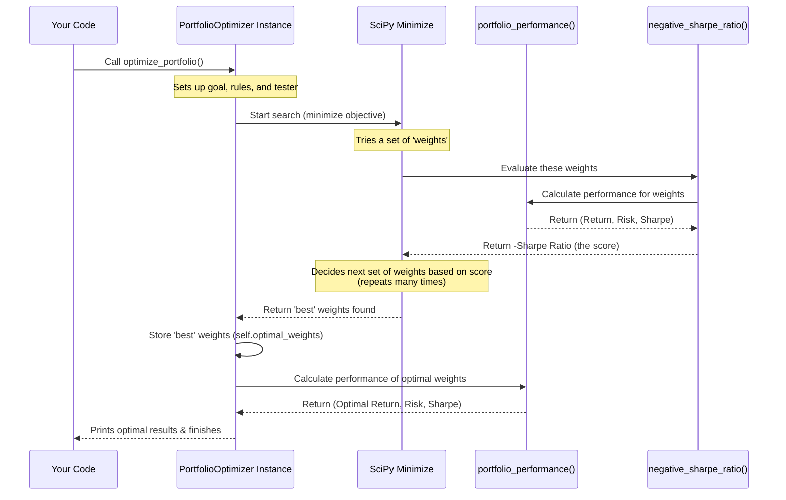

# Chapter 5: Portfolio Optimization Process

Welcome back to the Portfolio Optimizer tutorial! In our previous chapters, we've built up the foundation:
*   We met the `PortfolioOptimizer` class ([Chapter 1: PortfolioOptimizer Class](01_portfoliooptimizer_class_.md)).
*   We loaded historical stock returns data ([Chapter 2: Historical Returns Data](02_historical_returns_data_.md)).
*   We calculated important statistics like expected returns and the covariance matrix ([Chapter 3: Statistical Analysis (Expected Returns, Covariance Matrix)](03_statistical_analysis__expected_returns__covariance_matrix__.md)).
*   We learned how to calculate the overall performance (return, risk, Sharpe Ratio) for any *given* set of stock weights using the `portfolio_performance` method ([Chapter 4: Portfolio Performance Calculation](04_portfolio_performance_calculation_.md)).

Now, we arrive at the exciting part – the core of portfolio optimization!

## The Problem: Finding the "Best" Mix

In the last chapter, we saw that we can test a specific mix of stocks (like 20% in each of the 5 stocks) and calculate its expected return, risk, and Sharpe Ratio. But there are *countless* possible ways to combine those 5 stocks! You could put 50% in RIL and 50% in ICICI, or 10% in RIL, 40% in HDFC, and 50% in TCS, and so on.

How do we find the specific mix – the specific set of weights – that gives us the *best* possible result according to our goal?

Our goal, guided by Modern Portfolio Theory (MPT), is to maximize the **Sharpe Ratio**. The Sharpe Ratio tells us how much return we get for the amount of risk we take *above* the risk-free rate. A higher Sharpe Ratio means a better risk-adjusted return.

So, the problem is: **Find the set of weights for our stocks that results in the highest Sharpe Ratio for the overall portfolio.**

## The Solution: The Optimization Process

Instead of manually trying millions of combinations (which would take forever!), we use a powerful mathematical technique called **optimization**.

Think of optimization like using a super-smart search engine. You tell it:

1.  **What you want to achieve:** Find the portfolio mix that maximizes the Sharpe Ratio.
2.  **What it can change:** The percentage allocated to each stock (the weights).
3.  **Any rules it must follow:** The weights must add up to 100% (or 1.0), and you can't have negative weights (you can't 'short-sell' in this simple model – though MPT can handle that too).

The optimization algorithm uses the expected returns and the covariance matrix (which tells us how much risk each stock adds and how they move together) to intelligently explore different weight combinations. It doesn't just guess randomly; it uses sophisticated math to efficiently home in on the combination that is most likely to achieve the highest Sharpe Ratio while respecting the rules.

In our `PortfolioOptimizer` class, this entire search and calculation process is encapsulated in a single method: `optimize_portfolio()`.

## Using `optimize_portfolio()`

The `optimize_portfolio()` method is the central command that kicks off the search for the best stock mix. Since it uses the expected returns and covariance matrix that are already stored within the `optimizer` object (from [Chapter 3](03_statistical_analysis__expected_returns__covariance_matrix__.md)), it doesn't need you to provide any inputs when you call it.

Here's how you call it in your main code:

```python
# Assume optimizer instance is created
# and load_data() and calculate_portfolio_statistics() have been called
# from portfolio_optimizer import PortfolioOptimizer
# optimizer = PortfolioOptimizer()
# optimizer.load_data()
# optimizer.calculate_portfolio_statistics()

print("4️⃣ Optimizing portfolio...")
# This is the key step where the optimization happens!
optimizer.optimize_portfolio()

print("\nOptimization complete. Optimal weights stored and results printed!")
# The optimal weights and performance metrics
# are now available inside the 'optimizer' object.
```

When you call `optimizer.optimize_portfolio()`, the object takes control. It uses the loaded data and calculated statistics to find the weights that maximize the Sharpe Ratio, subject to the constraints.

After the optimization is finished, the `optimizer` object stores the resulting optimal weights in `self.optimal_weights` and also calculates and prints the performance metrics (return, volatility, Sharpe Ratio) for *that specific optimal mix*.

## What Happens Inside `optimize_portfolio()`?

Let's visualize the high-level process when `optimizer.optimize_portfolio()` is called.



As you can see, the `optimize_portfolio` method doesn't calculate the performance itself during the search; it relies on our `portfolio_performance` method (or a wrapper around it) to evaluate each potential set of weights that the `OptimizationTool` (the `minimize` function from the SciPy library) suggests. The `OptimizationTool`'s job is to keep trying different weights until it finds the set that minimizes the `ObjectiveFunction` (our wrapper that gives a score based on the Sharpe Ratio).

### The Objective Function: `negative_sharpe_ratio()`

Optimization libraries like SciPy's `minimize` are designed to *minimize* a function. Since our goal is to *maximize* the Sharpe Ratio, we need to minimize its *negative*. So, we create a small helper method called `negative_sharpe_ratio`.

This method takes a set of `weights`, calculates the portfolio performance for those weights using `self.portfolio_performance()`, and then simply returns the negative of the calculated Sharpe Ratio.

Here's the simple code for `negative_sharpe_ratio`:

```python
# Inside the PortfolioOptimizer class...

def negative_sharpe_ratio(self, weights):
    """Objective function to minimize (negative Sharpe ratio)"""
    # Calculate return, risk, and sharpe using the weights
    # We only need the sharpe_ratio (the third value returned)
    _, _, sharpe_ratio = self.portfolio_performance(weights)

    # Return the negative of the Sharpe Ratio for minimization
    return -sharpe_ratio
```

This method is crucial because it's the "scorecard" that the `minimize` function uses to judge how "good" a particular set of weights is. A lower negative Sharpe Ratio (meaning a higher positive Sharpe Ratio) is a better score.

### The Optimization Logic: Inside `optimize_portfolio()`

Now let's look at the key parts of the `optimize_portfolio` method itself, focusing on how it sets up and uses the `minimize` function.

```python
# Inside the PortfolioOptimizer class...

def optimize_portfolio(self):
    """Optimize portfolio for maximum Sharpe ratio"""

    num_assets = len(self.stocks) # Number of stocks

    # Define the RULES (Constraints) for the optimization:
    # Constraint 1: The sum of weights must be exactly 1.0 (100%)
    constraints = ({'type': 'eq', 'fun': lambda x: np.sum(x) - 1})

    # Define the LIMITS (Bounds) for each weight:
    # Bound: Each weight must be between 0 (0%) and 1 (100%)
    # 'tuple((0, 1) for _ in range(num_assets))' creates a list of (0, 1) pairs, one for each stock
    bounds = tuple((0, 1) for _ in range(num_assets))

    # Provide a starting point (Initial guess) for the optimization search:
    # Start with equal weights (e.g., 0.2 for 5 stocks)
    initial_weights = np.array([1/num_assets] * num_assets)

    # --- Now, use the optimization tool (minimize from SciPy) ---
    optimization_result = minimize(
        self.negative_sharpe_ratio, # The function to minimize (our objective)
        initial_weights,           # The starting point for weights
        method='SLSQP',            # The specific optimization algorithm to use
        bounds=bounds,             # Apply the limits (weights between 0 and 1)
        constraints=constraints,   # Apply the rules (weights sum to 1)
        options={'disp': False}    # Don't print detailed optimization steps
    )

    # The 'best' weights found are stored in the 'x' attribute of the result
    self.optimal_weights = optimization_result.x

    # --- Calculate and print the performance of the optimal portfolio ---
    opt_return, opt_volatility, opt_sharpe = self.portfolio_performance(self.optimal_weights)

    print("\n✓ Portfolio optimization completed")
    print("\nOptimal Portfolio Allocation:")
    # ... code to print the optimal weights and performance ...
    print(f"Expected Annual Return: {opt_return:>7.2%}")
    # ... etc. ...
```

**Explanation:**

1.  **Setup:** The method first gets the number of stocks to know how many weights it's dealing with.
2.  **Constraints:** It defines the rules. The key rule is that the sum of all weights must equal 1.0. This is expressed as a dictionary with `type: 'eq'` (meaning 'equal to zero') and a `fun` (function) that returns the sum of the weights minus 1.
3.  **Bounds:** It defines the limits for each weight. In this case, each weight must be between 0 and 1.
4.  **Initial Guess:** Optimization algorithms need a starting point. We provide a simple one: equal weights for all stocks.
5.  **`minimize`:** This is the core function call from the `scipy.optimize` library.
    *   We tell it *what* function to minimize (`self.negative_sharpe_ratio`).
    *   We give it the `initial_weights` to start from.
    *   We specify the `method` (SLSQP is a common and effective algorithm for this type of problem).
    *   We provide the `bounds` and `constraints` to ensure the results are valid portfolio weights.
6.  **Result:** The `minimize` function runs its search process. When it finds the weights that result in the lowest possible value for `negative_sharpe_ratio` (i.e., the highest Sharpe Ratio), it stops and returns the result in `optimization_result`. The optimal weights are stored in `optimization_result.x`.
7.  **Store and Report:** The method stores the `optimal_weights` in `self.optimal_weights` so other parts of the class (like visualization and reporting) can access them. Finally, it calculates the performance metrics for *these specific optimal weights* using `self.portfolio_performance()` and prints them out.

This `optimize_portfolio` method is the culmination of the previous steps. It takes the inputs (expected returns, covariance matrix) and the tools (`portfolio_performance`, `negative_sharpe_ratio`) and uses a powerful optimization algorithm to automatically find the portfolio mix that theoretically provides the best risk-adjusted return based on that historical data.

## Output of the Optimization Process

When `optimizer.optimize_portfolio()` runs, it will print the following to the console (the exact percentages will depend on the data and calculation):

```
✓ Portfolio optimization completed

Optimal Portfolio Allocation:
----------------------------------------
   RIL:  20.08%
 ICICI:  44.02%
   TCS:  35.90%
----------------------------------------
Expected Annual Return:  15.96%
Annual Volatility:        5.82%
Sharpe Ratio:             0.1305
```

Notice that the optimal portfolio doesn't necessarily include all stocks. The optimization process might determine that excluding certain stocks (like HDFC and ITC in this example) leads to a better overall risk-adjusted return for this specific set of inputs and period.

The printed output confirms that the optimization ran successfully and presents the discovered "best recipe" – the optimal weights and the resulting portfolio performance metrics.

## Conclusion

The `optimize_portfolio()` method is where the magic of Modern Portfolio Theory comes together in our project. By leveraging the expected returns and covariance matrix calculated previously, and using mathematical optimization techniques (specifically, minimizing the negative Sharpe Ratio subject to constraints), it automatically searches for and identifies the set of stock weights that is predicted to provide the highest risk-adjusted return.

This is the core output of our analysis – the recommended asset allocation based on the historical data and MPT principles.

Now that we have the optimal portfolio, the next steps are to further analyze the stocks (especially their systematic risk using CAPM Beta) and then present all these findings clearly.

[Next Chapter: CAPM Beta Analysis](06_capm_beta_analysis_.md)

---
