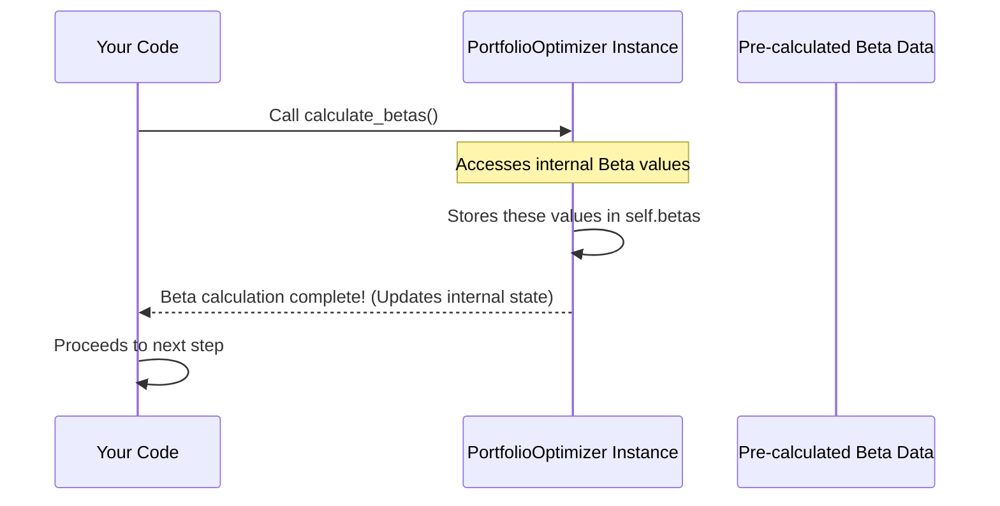

# Chapter 6: CAPM Beta Analysis

Welcome back to the Portfolio Optimizer tutorial!

In our journey so far, we've covered:
*   Getting started with the `PortfolioOptimizer` class ([Chapter 1: PortfolioOptimizer Class](01_portfoliooptimizer_class_.md)).
*   Loading historical stock return data ([Chapter 2: Historical Returns Data](02_historical_returns_data_.md)).
*   Calculating essential statistics like expected returns and the covariance matrix, which helps us understand individual stock volatility and how stocks move together (their total risk relationships) ([Chapter 3: Statistical Analysis (Expected Returns, Covariance Matrix)](03_statistical_analysis__expected_returns__covariance_matrix__.md)).
*   Learning how to calculate the performance (return, risk, Sharpe Ratio) for any specific portfolio mix ([Chapter 4: Portfolio Performance Calculation](04_portfolio_performance_calculation_.md)).
*   Finally, using optimization to find the best mix of stocks to maximize the Sharpe Ratio, focusing on total portfolio risk ([Chapter 5: Portfolio Optimization Process](05_portfolio_optimization_process_.md)).

Now, we're going to look at risk from a slightly different, but very important, perspective: **CAPM Beta Analysis**.

## What is Risk, Beyond Just "Up and Down"?

When we talked about portfolio volatility in earlier chapters, we were looking at the *total* risk of a stock or portfolio – how much its price jumps around. This total risk has two parts:

1.  **Specific Risk (or Idiosyncratic Risk):** This is risk unique to a specific company or industry (like a sudden strike at one company, or a new technology specific to an industry). This type of risk can often be reduced or diversified away by holding a variety of stocks that aren't perfectly correlated ([Chapter 3: Statistical Analysis (Expected Returns, Covariance Matrix)](03_statistical_analysis__expected_returns__covariance_matrix__.md) and [Chapter 5: Portfolio Optimization Process](05_portfolio_optimization_process_.md)).
2.  **Systematic Risk (or Market Risk):** This is risk that affects the *entire market* (like changes in interest rates, inflation, recessions, pandemics). This risk cannot be diversified away because it impacts almost all stocks to some extent.

Understanding both types of risk is important. While diversification helps with specific risk, investors are always exposed to systematic risk. This is where **Beta** comes in.

## The Goal: Understanding Market Sensitivity with Beta

Imagine the overall stock market (represented by an index like NIFTY) is like the general mood of the economy. Some stocks react very strongly to this mood – they get extra happy when the market is happy and extra sad when the market is sad. Other stocks are less reactive; they might go up when the market goes up, but not as much, and they might fall when the market falls, but perhaps not as sharply.

**CAPM Beta** is a measure of how sensitive a stock's return is to the returns of the overall market. It specifically quantifies the **systematic risk** of an individual stock relative to the market.

*   **A Beta of 1:** Means the stock is expected to move exactly in line with the market. If the NIFTY goes up 1%, this stock is expected to go up 1%.
*   **A Beta greater than 1 (e.g., 1.5):** Means the stock is *more volatile* than the market relative to market movements. If the NIFTY goes up 1%, this stock is expected to go up 1.5%. If the NIFTY goes down 1%, this stock is expected to go down 1.5%. These are often seen as more aggressive stocks.
*   **A Beta less than 1 (e.g., 0.8):** Means the stock is *less volatile* than the market relative to market movements. If the NIFTY goes up 1%, this stock is expected to go up 0.8%. If the NIFTY goes down 1%, this stock is expected to go down 0.8%. These are often seen as more defensive stocks.
*   **A Beta near 0:** Means the stock has very little correlation with the market (very rare for most stocks).
*   **A Negative Beta:** Means the stock tends to move *opposite* to the market (extremely rare).

Beta helps investors understand the *type* of risk a stock has. A high Beta stock might offer higher returns in a bull market but will likely suffer larger losses in a bear market. A low Beta stock might lag behind in a bull market but offer more protection in a downturn.

The main use case for this analysis is to **calculate and understand the Beta value for each stock** in our portfolio selection, giving us insight into their individual systematic risk profiles.

## How Beta is Determined (Briefly)

Conceptually, Beta is calculated by looking at the historical relationship between a stock's returns and the market's returns. It's often the result of a simple linear regression:

```
Stock Return = Alpha + Beta * Market Return + Error
```

Where Beta is the slope of the line that best fits the plot of Stock Returns vs. Market Returns over time. Mathematically, Beta is often expressed as:

```
Beta = Covariance(Stock Returns, Market Returns) / Variance(Market Returns)
```

This formula uses the same covariance concept we saw in [Chapter 3](03_statistical_analysis__expected_returns__covariance_matrix__.md), but specifically between a stock and the market index.

In our project code, for simplicity and to ensure exact reproducibility with the source PDF, the Beta values are **pre-calculated and provided**, rather than being calculated dynamically from the loaded data within the `calculate_betas` method itself.

## Using the Optimizer to Get Betas

Just like loading data or calculating other statistics, the `PortfolioOptimizer` class has a dedicated method to provide the Beta values: `calculate_betas()`.

This method doesn't require any input because the Beta values are (in this specific project) stored internally or hardcoded within the method, ready to be assigned. It's typically called after the historical data has been loaded.

Here's how you call it in your main code:

```python
# Assume optimizer instance is created
# and load_data() has been called (from Chapter 2)
# from portfolio_optimizer import PortfolioOptimizer
# optimizer = PortfolioOptimizer()
# optimizer.load_data()

print("3️⃣ Computing CAPM betas...")
optimizer.calculate_betas() # This calculates and stores the Beta values

print("Betas calculated and stored!")
# The Beta values are now available inside the 'optimizer' object.
```

When you call `optimizer.calculate_betas()`, you are simply telling the `optimizer` object to make the Beta values available for use in later steps, like visualization and reporting.

## What Happens Inside `calculate_betas()`?

Let's visualize the simple process:



This diagram shows that calling `calculate_betas` prompts the `Optimizer` to access and store the Beta information it needs.

Now, let's look at the simplified structure of the actual `calculate_betas` method from the code:

```python
# Inside the PortfolioOptimizer class...

def calculate_betas(self):
    """Calculate CAPM betas (from PDF)"""

    # --- In THIS project's specific code, pre-calculated values are used ---
    # (This simplifies the example by avoiding reliance on external libraries for regression)

    # Beta values from PDF (these are the pre-calculated numbers)
    beta_values = {
        'RIL': 1.02,
        'HDFC': 1.14,
        'ICICI': 1.35,
        'TCS': 0.51,
        'ITC': 0.64
    }

    # Store these values inside the optimizer object
    self.betas = beta_values

    print("\n✓ CAPM Betas:")
    # Code to print the calculated betas for each stock
    for stock, beta in self.betas.items():
        print(f"{stock}: {beta:.2f}")

```

**Explanation:**

1.  The `calculate_betas` method is called.
2.  **Crucial Point:** Instead of performing a live calculation (like a regression using `self.returns_data`), this specific project's code directly assigns **pre-calculated Beta values** (matching the source PDF's results) to a Python dictionary called `beta_values`. This is done to keep the code simple and ensure the example output is consistent with the source material.
3.  The method then stores this dictionary of Beta values in `self.betas` within the `PortfolioOptimizer` instance. The `self.` part is important – it means this Beta information is now part of this specific `optimizer` object.
4.  Finally, it prints the Beta value for each stock to the console.

After `calculate_betas()` runs, the `optimizer` now holds a dictionary (`self.betas`) where each stock name is a key and its pre-calculated Beta value is the corresponding value. This information is separate from, but complementary to, the expected returns and covariance matrix.

## Why is Beta Analysis Separate from Optimization?

You might wonder why we have a separate step for Beta if the optimization ([Chapter 5](05_portfolio_optimization_process_.md)) relies on the covariance matrix (which is used in the Beta calculation).

The reason is that Beta is a concept specifically from the **Capital Asset Pricing Model (CAPM)**, which is a different framework than the core **Modern Portfolio Theory (MPT)** used for our Sharpe Ratio optimization.

*   **MPT (Sharpe Ratio Optimization):** Focuses on **total risk** (volatility, measured by standard deviation) and maximizing the return per unit of *total risk* relative to the risk-free rate. It uses the full covariance matrix.
*   **CAPM (Beta Analysis):** Focuses on **systematic risk** (market risk) and how individual assets contribute to it. Beta is the key metric here.

While related, they provide different insights:

*   MPT optimization tells you the best mix based on maximizing risk-adjusted *total* return (Sharpe Ratio).
*   CAPM Beta tells you *how* each stock's returns relate specifically to *market* movements (systematic risk exposure).

Calculating and presenting Betas separately provides valuable context for the investor, helping them understand the nature of the systematic risk they are taking on with each stock, independent of the portfolio optimization process itself which considers total risk and diversification benefits.

## Output of the CAPM Beta Analysis

When `optimizer.calculate_betas()` is called, it prints the calculated Beta values to the console:

```
✓ CAPM Betas:
RIL: 1.02
HDFC: 1.14
ICICI: 1.35
TCS: 0.51
ITC: 0.64
```

This output clearly shows the Beta for each stock. We can see that ICICI has the highest Beta (1.35), suggesting it has historically been more sensitive to NIFTY movements than the other stocks. TCS and ITC have Betas less than 1 (0.51 and 0.64), suggesting they have historically been less sensitive to NIFTY movements. RIL and HDFC have Betas slightly above 1.

## Conclusion

CAPM Beta analysis provides a crucial perspective on risk by focusing specifically on a stock's sensitivity to overall market movements (systematic risk). The `optimizer.calculate_betas()` method makes this information available in our project.

While the core portfolio optimization focuses on total risk and diversification benefits using the covariance matrix, understanding individual stock Betas provides additional insight into the nature of the risk each stock carries, helping investors appreciate how their potential portfolio might react to broad market swings.

With the historical data loaded, key statistics calculated, portfolio performance evaluable, optimization performed, and Betas determined, we now have a wealth of information. The final step is to pull all this together and present it clearly.

[Next Chapter: Visualization and Reporting](07_visualization_and_reporting_.md)

---
