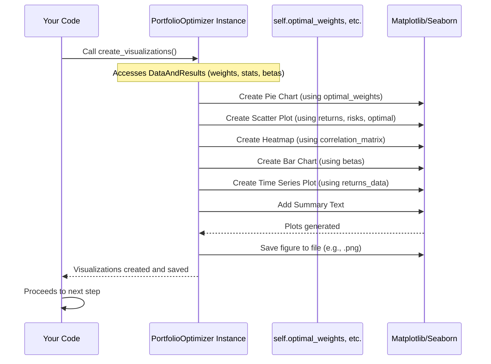
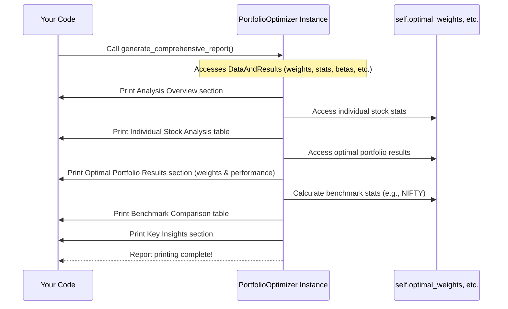

# Chapter 7: Visualization and Reporting

Welcome to the final chapter of the Portfolio Optimizer tutorial! You've come a long way.

We've covered the core steps of portfolio analysis and optimization:
*   We initialized our `PortfolioOptimizer` ([Chapter 1: PortfolioOptimizer Class](01_portfoliooptimizer_class_.md)).
*   We loaded the historical data ([Chapter 2: Historical Returns Data](02_historical_returns_data_.md)).
*   We calculated key statistics like expected returns and the covariance matrix ([Chapter 3: Statistical Analysis (Expected Returns, Covariance Matrix)](03_statistical_analysis__expected_returns__covariance_matrix__.md)).
*   We learned how to evaluate the performance of any specific portfolio mix ([Chapter 4: Portfolio Performance Calculation](04_portfolio_performance_calculation_.md)).
*   We optimized the portfolio to find the mix that maximizes the Sharpe Ratio ([Chapter 5: Portfolio Optimization Process](05_portfolio_optimization_process_.md)).
*   We analyzed the individual stocks' systematic risk using CAPM Beta ([Chapter 6: CAPM Beta Analysis](06_capm_beta_analysis_.md)).

After all that hard work calculating, analyzing, and optimizing, we now have a wealth of valuable information: the optimal weights for our stocks, the expected return and risk of that optimal portfolio, the individual stock statistics, and their Betas.

But these results are currently just numbers stored inside our `optimizer` object or printed as plain text. How do we make these findings easy to understand for ourselves or for others?

## The Problem: Making Sense of Complex Results

Imagine you've just finished a detailed study. You have pages and pages of data tables and calculations. Showing someone just these raw numbers is overwhelming and makes it hard to grasp the key takeaways quickly.

The problem is that complex financial analysis, while powerful, needs to be translated into a format that is intuitive and easy to digest. We need to answer questions like:

*   What does the *optimal* portfolio actually *look like*? (Which stocks and how much of each?)
*   How risky are the individual stocks compared to their potential return?
*   How do the stocks move together? (Are they good for diversification?)
*   How sensitive is each stock to the overall market?
*   What are the final performance numbers (Return, Risk, Sharpe Ratio) for the *best* portfolio found?

## The Solution: Visualization and Reporting

This is where **Visualization and Reporting** come in. This step is all about presenting the findings clearly and effectively. It's like creating a summary presentation and an executive report after a big project.

In our `PortfolioOptimizer`, two methods are primarily responsible for this:

1.  **`create_visualizations()`:** This method generates charts and plots that visually represent the key results. Charts can show relationships, distributions, and trends much more effectively than tables of numbers.
2.  **`generate_comprehensive_report()`:** This method prints a structured, detailed text summary of the entire analysis, bringing together all the important numbers and insights in one place.

These methods take the data and results that are already stored within the `optimizer` object and format them for presentation.

## Using the Optimizer for Presentation

Since the visualization and reporting methods simply *present* the results that were calculated in previous steps, they need to be called *after* all the analysis and optimization is complete.

In the main workflow, you call them towards the end, like this:

```python
# Assume optimizer instance is created
# and all previous steps (load_data, calculate_stats, calculate_betas, optimize)
# have been called successfully

# from portfolio_optimizer import PortfolioOptimizer
# optimizer = PortfolioOptimizer()
# ... call previous methods ...
# optimizer.optimize_portfolio() # This step finds the optimal_weights
# optimizer.calculate_betas()    # This step stores the betas

print("\n5️⃣ Creating visualizations...")
optimizer.create_visualizations() # This generates charts and saves a file

print("\n6️⃣ Generating comprehensive report...")
optimizer.generate_comprehensive_report() # This prints the detailed report
```

When you call `optimizer.create_visualizations()`, it uses libraries like Matplotlib and Seaborn (which you'll see imported at the top of the full code) to draw the charts and arrange them into a single image file (like `portfolio_analysis.png`).

When you call `optimizer.generate_comprehensive_report()`, it formats the calculated numbers into human-readable text and prints it directly to your console.

Let's look at what happens inside each of these methods.

## Inside `create_visualizations()`

The `create_visualizations()` method is like setting up a dashboard with multiple important charts.



This diagram shows the `Optimizer` orchestrating the creation of several plots using its internal data and external plotting tools.

Here are some of the key visualizations created by this method and a peek at the code involved:

### 1. Optimal Portfolio Allocation (Pie Chart)

*   **Purpose:** To clearly show the percentage weight of each stock in the *optimal* portfolio found by the optimization process. It gives an immediate visual sense of the concentration of the portfolio.
*   **Data Used:** `self.optimal_weights` and `self.stocks`.
*   **Concept:** Use `matplotlib.pyplot.pie()` to draw a pie chart where each slice represents a stock's weight.

```python
# Simplified snippet from create_visualizations()

# Assuming optimal_weights are stored
non_zero_weights = [(stock, weight) for stock, weight in zip(self.stocks, self.optimal_weights) if weight > 0.001]
stocks_nz, weights_nz = zip(*non_zero_weights) # Get stocks and weights for slices

ax1 = plt.subplot(2, 3, 1) # Position the chart
ax1.pie(
    weights_nz,
    labels=stocks_nz,
    autopct='%1.1f%%', # Format percentage on slices
    startangle=90
)
ax1.set_title('Optimal Portfolio Allocation')
```

This code snippet selects only the stocks that have a significant weight (greater than 0.1%) and then uses `matplotlib` to draw the pie chart.

### 2. Risk-Return Profile (Scatter Plot)

*   **Purpose:** To visualize the trade-off between risk (volatility) and expected return. It plots each individual stock and the calculated optimal portfolio on the same chart. This helps show how the optimal portfolio balances risk and return.
*   **Data Used:** `self.expected_returns`, `self.cov_matrix` (to get individual stock volatilities), and the calculated performance of the optimal portfolio (`opt_vol`, `opt_return`).
*   **Concept:** Calculate annual return and volatility for each stock and the optimal portfolio, then use `matplotlib.pyplot.scatter()` to plot points.

```python
# Simplified snippet from create_visualizations()

# Calculate annual stats for individual stocks (from data stored in self)
annual_returns = self.expected_returns * 12
annual_volatility = np.sqrt(np.diag(self.cov_matrix) * 12) # Individual stock vol

ax2 = plt.subplot(2, 3, 2) # Position the chart
ax2.scatter(annual_volatility, annual_returns, s=100) # Plot individual stocks

# Add labels next to points
for i, stock in enumerate(self.stocks):
    ax2.annotate(stock, (annual_volatility.iloc[i], annual_returns.iloc[i]), xytext=(5, 5))

# Calculate and plot the optimal portfolio point
opt_return, opt_vol, _ = self.portfolio_performance(self.optimal_weights)
ax2.scatter(opt_vol, opt_return, s=200, c='red', marker='*', label='Optimal Portfolio')

ax2.set_xlabel('Annual Volatility')
ax2.set_ylabel('Expected Annual Return')
ax2.set_title('Risk-Return Profile')
ax2.legend()
# ... add formatting for percentages ...
```

This code calculates the annual volatility for each stock (which is the square root of its variance, found on the diagonal of the covariance matrix) and its annual expected return, then plots these. It also adds a special point for the optimal portfolio's risk and return.

### 3. Correlation Matrix (Heatmap)

*   **Purpose:** To visually show the relationships between the returns of different stocks and the NIFTY index. A bright color (like red) might indicate high positive correlation (they move together), a cool color (like blue) high negative correlation (they move opposite), and a neutral color (like white/gray) low correlation. This is key for understanding diversification benefits.
*   **Data Used:** `self.correlation_matrix`.
*   **Concept:** Use `seaborn.heatmap()` to create a grid where color intensity represents the correlation value between each pair of assets.

```python
# Simplified snippet from create_visualizations()

ax3 = plt.subplot(2, 3, 3) # Position the chart
# Select correlation data including stocks and NIFTY
corr_subset = self.correlation_matrix.loc[self.stocks + ['NIFTY'], self.stocks + ['NIFTY']]

# Create the heatmap
sns.heatmap(
    corr_subset,
    annot=True, # Show correlation values on cells
    cmap='RdYlBu_r', # Color map (Red-Yellow-Blue, reversed)
    center=0,      # Center the color map around 0
    square=True,   # Make cells square
    ax=ax3,
    fmt='.2f'      # Format values as float with 2 decimal places
)
ax3.set_title('Correlation Matrix')
```

This uses `seaborn`, which is great for statistical plots, to draw the heatmap based on the correlation matrix we calculated in [Chapter 3](03_statistical_analysis__expected_returns__covariance_matrix__.md).

### 4. CAPM Beta Analysis (Bar Chart)

*   **Purpose:** To visually compare the Beta value of each stock, showing their sensitivity to the market (NIFTY). This reinforces the systematic risk analysis from [Chapter 6](06_capm_beta_analysis_.md).
*   **Data Used:** `self.betas`.
*   **Concept:** Use `matplotlib.pyplot.bar()` to draw a bar chart where the height of each bar represents a stock's Beta. Add a line at Beta=1 for reference.

```python
# Simplified snippet from create_visualizations()

ax4 = plt.subplot(2, 3, 4) # Position the chart
beta_values = list(self.betas.values()) # Get the list of Beta numbers

bars = ax4.bar(self.stocks, beta_values) # Draw bars
ax4.axhline(y=1, color='red', linestyle='--') # Add line at Beta=1
ax4.set_ylabel('Beta')
ax4.set_title('CAPM Beta Analysis')

# Add Beta value labels on top of bars (optional but in code)
for bar, value in zip(bars, beta_values):
    height = bar.get_height()
    ax4.text(bar.get_x() + bar.get_width()/2., height + 0.02, f'{value:.2f}', ha='center')
```

This code takes the Beta values stored in `self.betas` and creates a simple bar chart to compare them visually.

### 5. Monthly Returns Over Time (Line Plot)

*   **Purpose:** To show the historical journey of each stock's monthly returns and the NIFTY index over the analysis period. This provides context and shows periods of high volatility or strong trends.
*   **Data Used:** `self.returns_data`.
*   **Concept:** Use `matplotlib.pyplot.plot()` to draw line charts for each stock and NIFTY over time.

```python
# Simplified snippet from create_visualizations()

ax5 = plt.subplot(2, 3, 5) # Position the chart

# Plot each stock's returns
for i, stock in enumerate(self.stocks):
    ax5.plot(self.returns_data.index, self.returns_data[stock], label=stock)

# Plot NIFTY returns
ax5.plot(self.returns_data.index, self.returns_data['NIFTY'], label='NIFTY', color='black')

ax5.set_ylabel('Monthly Returns')
ax5.set_title('Monthly Returns Over Time')
ax5.legend()
ax5.tick_params(axis='x', rotation=45) # Rotate dates for readability
# ... add formatting for percentages ...
```

This plots the raw historical data loaded in [Chapter 2](02_historical_returns_data_.md) as time series lines.

### 6. Portfolio Performance Summary (Text Box)

*   **Purpose:** To display the key performance metrics of the optimal portfolio and a benchmark (like an equal-weighted portfolio) directly on the visualization dashboard for quick reference.
*   **Data Used:** Calculated performance metrics for the optimal portfolio and an equal-weighted portfolio.
*   **Concept:** Use `matplotlib.pyplot.text()` or similar to place formatted text onto an empty subplot.

```python
# Simplified snippet from create_visualizations()

ax6 = plt.subplot(2, 3, 6) # Position the text box
ax6.axis('off') # Hide axes for a clean text box

# Calculate performance for optimal and equal-weighted
opt_return, opt_vol, opt_sharpe = self.portfolio_performance(self.optimal_weights)
equal_weights = np.array([0.2] * 5)
eq_return, eq_vol, eq_sharpe = self.portfolio_performance(equal_weights)

# Format the summary text
summary_text = f"""
PORTFOLIO PERFORMANCE SUMMARY

Optimal Portfolio:
• Expected Return: {opt_return:.2%}
• Volatility: {opt_vol:.2%}
• Sharpe Ratio: {opt_sharpe:.2%}

Equal-Weighted Comparison:
• Expected Return: {eq_return:.2%}
... and so on ...
"""

# Display the text
ax6.text(0.05, 0.95, summary_text, transform=ax6.transAxes, verticalalignment='top', fontsize=10)
```

This creates a dedicated space to show the final numbers in a clear, formatted text block.

After all these subplots are created, the `create_visualizations()` method uses `plt.tight_layout()` to arrange them nicely and `plt.savefig()` to save the entire figure as a single image file (`portfolio_analysis.png`). Finally, `plt.show()` displays the plot if you're running the script in an environment that supports it.

## Inside `generate_comprehensive_report()`

While visualizations are great for quick understanding, a detailed text report provides all the specific numbers and contextual information in a format suitable for reading and record-keeping.

The `generate_comprehensive_report()` method is like writing a detailed executive summary.



This diagram shows the `Optimizer` gathering information from its internal storage and printing it section by section to the console (which is represented by `Main` receiving the printed text).

Here are the key sections printed by this method:

1.  **Analysis Overview:** Basic details like the analysis period, stocks included, risk-free rate, and the method used.
2.  **Individual Stock Analysis:** A table summarizing key metrics for each stock: Expected Annual Return, Annual Volatility, Beta, and Correlation with NIFTY. This is very useful for comparing stocks side-by-side.
3.  **Optimal Portfolio Results:** Lists the specific optimal weights found by the optimization and the resulting Expected Annual Return, Volatility, and Sharpe Ratio for the *optimal portfolio*.
4.  **Benchmark Comparison:** Compares the performance (Return, Volatility, Sharpe Ratio) of the Optimal Portfolio against simple benchmarks like an Equal-Weighted portfolio and the NIFTY index itself. This highlights the benefit of optimization.
5.  **Key Insights:** A bulleted list summarizing the most important findings, like the concentration of the portfolio, the highest allocation, the portfolio's overall Beta, and the percentage improvement in Sharpe Ratio over the equal-weighted portfolio.

The code within `generate_comprehensive_report()` primarily involves:

*   Retrieving the necessary data from `self` variables (`self.stocks`, `self.returns_data`, `self.expected_returns`, `self.cov_matrix`, `self.betas`, `self.correlation_matrix`, `self.optimal_weights`, `self.risk_free_rate`).
*   Performing minor calculations needed for the report (like annualizing monthly numbers, calculating benchmark performance, finding the stock with the highest weight).
*   Using `print()` statements with f-strings to format the output text neatly. It uses techniques like string formatting (`:.2%`, `:.2f`) and creating pandas DataFrames (`pd.DataFrame`) to then print as tables (`.to_string(index=False)`).

Here's a simple example of the table generation concept:

```python
# Simplified snippet from generate_comprehensive_report()

print(f"\n📈 INDIVIDUAL STOCK ANALYSIS")
print(f"{'─'*80}")

analysis_data = []
for stock in self.stocks:
    annual_return = self.expected_returns[stock] * 12
    annual_vol = np.sqrt(self.cov_matrix.loc[stock, stock] * 12)
    beta = self.betas[stock]
    corr_nifty = self.correlation_matrix.loc[stock, 'NIFTY']

    analysis_data.append({
        'Stock': stock,
        'Expected Return': f"{annual_return:.2%}",
        'Volatility': f"{annual_vol:.2%}",
        'Beta': f"{beta:.2f}",
        'Correlation w/ NIFTY': f"{corr_nifty:.3f}"
    })

analysis_df = pd.DataFrame(analysis_data)
print(analysis_df.to_string(index=False)) # Print the DataFrame as a table
```

This snippet demonstrates how data for the individual stock table is collected into a list of dictionaries, converted into a pandas DataFrame, and then printed in a clean table format. Other sections follow a similar pattern of gathering data and printing formatted strings.

## Output: What You Get

After running `optimizer.create_visualizations()` and `optimizer.generate_comprehensive_report()`, you will have:

1.  An image file (by default `portfolio_analysis.png`) containing the dashboard of plots.
2.  Detailed analysis text printed in your console.

These outputs provide a comprehensive overview of the analysis, from the raw data representation to the final optimized portfolio details and performance metrics, presented in easy-to-understand visual and textual formats.

*(Note: The project code also includes an `export_results()` method called right after the report. This method saves the results into CSV files (`.csv`), which is another way of reporting/sharing data, particularly for further analysis or integration with other tools. This is often considered part of the final output stage.)*

## Conclusion

Visualization and Reporting are the crucial final steps in our portfolio optimization project. They take the complex numerical outputs from the analysis and optimization processes and translate them into clear, accessible formats.

The `create_visualizations()` method generates informative charts like pie charts for weights, scatter plots for risk/return, and correlation heatmaps, saving them into a single image file. The `generate_comprehensive_report()` method prints a detailed textual summary covering all aspects of the analysis, from individual stock characteristics to optimal portfolio performance and benchmarks.

Together, these methods ensure that the powerful results of the `PortfolioOptimizer` are not just numbers in a program but actionable insights presented effectively, allowing you or others to understand the recommended portfolio allocation and its expected performance.

This completes our journey through the core functionalities of the `PortfolioOptimizer_` project. You now understand how it loads data, performs statistical analysis, calculates performance, finds the optimal portfolio, analyzes systematic risk, and presents all these findings.

We hope this tutorial has provided a solid foundation for understanding and using the `PortfolioOptimizer` class and the concepts of Modern Portfolio Theory and CAPM!

---
