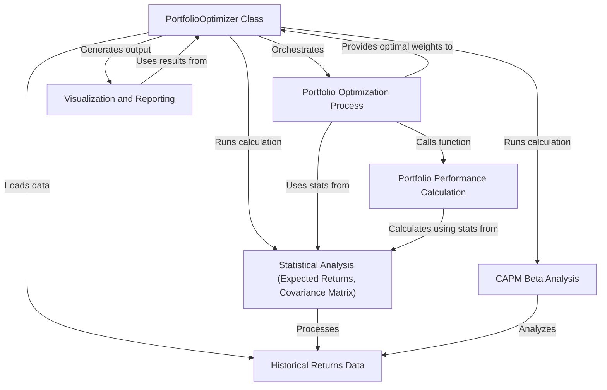

Portfolio Optimizer

This project is a Python tool that helps **analyze** and **optimize** a stock
portfolio. It uses **historical data** to calculate key financial statistics,
finds the *optimal mix* of stocks to get the best return for the risk taken
(using Modern Portfolio Theory), and then presents the findings through
**visualizations and reports**.

## Visual Overview

## Chapters

1. [PortfolioOptimizer Class
](01_portfoliooptimizer_class_.md)
2. [Historical Returns Data
](02_historical_returns_data_.md)
3. [Statistical Analysis (Expected Returns, Covariance Matrix)
](03_statistical_analysis__expected_returns__covariance_matrix__.md)
4. [Portfolio Performance Calculation
](04_portfolio_performance_calculation_.md)
5. [Portfolio Optimization Process
](05_portfolio_optimization_process_.md)
6. [CAPM Beta Analysis
](06_capm_beta_analysis_.md)
7. [Visualization and Reporting
](07_visualization_and_reporting_.md)

---
